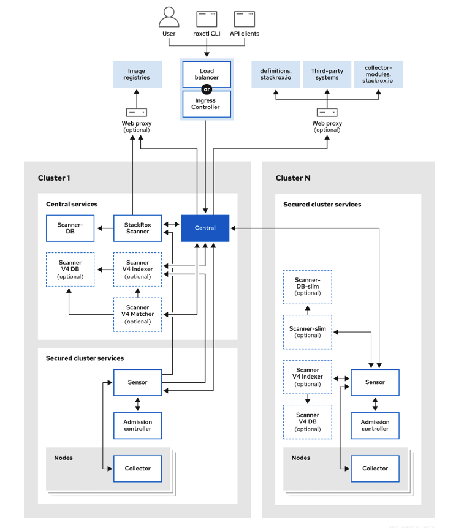
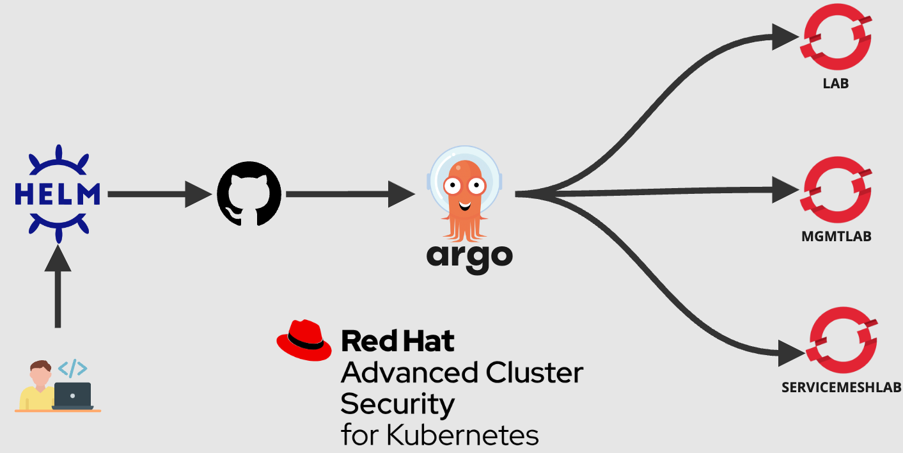
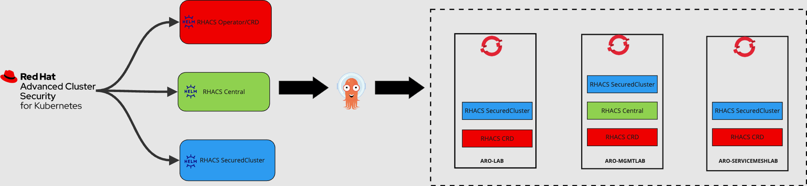
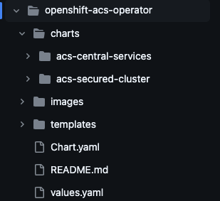
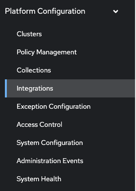
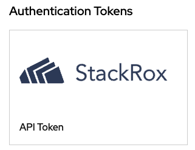
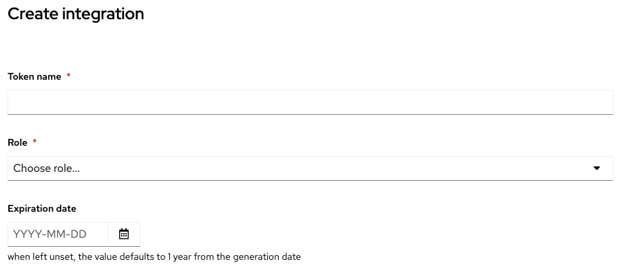

# Helm Chart to install  Red Hat Advanced Cluster Security for Kubernetes with Openshift GitOps

## Goals
The goal of this Helm charts is to provides Helm charts that will manage the deployment of ACS components into cluster.

## RHACS Compoments
To install ACS Operator, you need to install their components.

- **Central**: [Centralized components] Central is the main component of Red Hat Advanced Cluster Security for Kubernetes and it is installed as a Kubernetes deployment. It handles data persistence, API interactions, and user interface (Portal) access. You can use the same Central instance to secure multiple OpenShift Container Platform or Kubernetes clusters.

- **Scanner**: [Centralized component] Red Hat Advanced Cluster Security for Kubernetes includes an image vulnerability scanning component called Scanner. It analyzes all image layers to check for known vulnerabilities from the Common Vulnerabilities and Exposures (CVEs) list. Scanner also identifies vulnerabilities in packages installed by package managers and in dependencies for multiple programming languages.

- **Sensor**: [1 x Per Cluster] Red Hat Advanced Cluster Security for Kubernetes uses the Sensor component to monitor Kubernetes and OpenShift Container Platform clusters. It handles interactions with the OpenShift Container Platform or Kubernetes API server for policy detection and enforcement, and it coordinates with Collector.

- **Admission controller**: [1 x Cluster] The admission controller prevents users from creating workloads that violate security policies in Red Hat Advanced Cluster Security for Kubernetes. [1 x Admission Controller]

- **Collector**: [1 x Node OCP/K8s Nodes] Collector collects and monitors information about container runtime and network activity. It then sends the collected information to Sensor.

## RHACS Architecture 

The relationship between ACS Components can be found below :



## RHACS Configuration:

To deploy RH ACS we use the tools defined as the picture bellow : 


## RHACS Deployment: 

The Deployment of ACS is done with helm charts, we have defined three helm chart and deploy them on each cluster depending on their type.


## RHACS Install with Helm Chart

The Helm charts to install ACS Operator are composed of the following components:

- **ACS Operator**: Install CRD(Custom Resources Definition) on each cluster for RHACS.
- **ACS Central Compoenents**: Installed on one cluster.
- **ACS SecuredCluster Compoenents**: Installed on each cluster you want to secure by RHACS.

### RHACS Helm chart directory structure :



### RHACS Helm charts

#### [Helm chart acs-operator](./rhacs/acs-operator/Chart.yaml) : 


> [!NOTE]
> This ressource is required on every cluster, it install all CRD.
This chart will be installed on all cluster to create custom CRD.

```yaml
operator:
  approvalPlan: Automatic # By default.
  version: rhacs-operator.v4.5.4

components:
  central:
    enabled: true # true or false to install  acs-central-services chart.
  securedcluster:
    enabled: true # true or false to install  acs-secured-cluster chart.

acs-secured-cluster: # Name of the sub or children chart to override the values used by the charts.
  cluster:
    clusterName: aro-mgmtlab # Name of the cluster to inegrate with RHACS.
  central:
    # put this value with https
    # Endpoint of the central that will be generated: <central-name>-<namespace>.<Ingress.spec.domain>
    endpoint: 'central-stackrox.apps.aro-mgmtlab.euw-hub02.azure.volvo.net' 
```

This chart will create the following ressources:
- acs-namespaces.yaml : 
    - Create Namespace `rhacs-operator`
- acs-operatorgroup.yaml: 
    - Create OperatorGroup `rhacs-operator`
- acs-subscription.yaml: 
    - Create Subcription `rhacs-operator`
- acs-services.namespaces.yaml: 
    - Create Namespace `stackrox` where we will install the Central and SecuredCluster components.
- acs-operator-installplan-approver-sa.yaml :
    - Create Role `acs-operator-installplan-approver` in the namespaces `rhacs-operator` with rigths `list,get,patch,update` on ressource `installplans`.
    - Create RoleBinding `acs-operator-installer` in the namespaces `rhacs-operator`
    - Create ServiceAccount `acs-operator-installer`
- acs-operator-installplan-approver-job.yaml:
    - Create a Job that will do the following steps:
        - Verify that an ACS InstallPlan exist.
        - Retrieve ACS InstallPlan generated.
        - Approve the InstallPlan.
- acs-auth-secret.yaml: 
    - Create the default Administratr password used to connect to RHACS in the project `stackrox`


#### [Helm chart acs-central-services]( ./rhacs/acs-operator/charts/acs-central-services/Chart.yaml/):

> [!CAUTION]
> This ressource should only be installed in the central cluster.

To use this chart, you will need to add the diffent groups as here :

To configure the chart

```yaml
oauth_provider:
  groups:   
    - key: groups
      value: <Name of the group>
      role: Admin
```

This chart will create the following ressources:
- central-services.yaml : 
    - Create Central ressources `stackrox-central-services` in the namespaces `stackrox`.
- central-openshift-auth.yaml :
    - Create Declaration configuration for Openshift Auth used to connect to RHACS with the differents Roles.

#### [Helm chart acs-secured-cluster](./rhacs/acs-operator/charts/acs-secured-cluster/Chart.yaml/):

> [!CAUTION]
> This ressource should be installed on each cluster to be managed by ACS.
> It is required to have ACS operator installed to have all the CRD.

To use this chart, you will need to get Central endpoint and an API TOKEN.
```yaml
# SecuredCluster Configuration.
cluster:
  clusterName: local-cluster # Name of the cluster to inegrate with RHACS.

central:
  # put this value with https
  # Endpoint of the central that will be generated: <central-name>-<namespace>.<Ingress.spec.domain>
  endpoint: 'central-stackrox.apps.aro-mgmtlab.euw-hub02.azure.volvo.net'
```
This chart will create the following ressources:
- create-cluster-init-bundle-sa.yaml :
    - Create Role `rhacs-services` in the namespaces `stackrox` with rigths `list,get,create,patch,update` on ressources `platform.stackrox.io`and `securedClusters`.
    - Create RoleBinding `rhacs-services` in the namespaces `stackrox`
    - Create ServiceAccount `rhacs-services`

- create-cluster-init-bundle-job.yaml:
    - Create a Job that will do the following steps:
        - Verify that central endpoint is available.
        - Retrieve roxctl command line.
        - Generate init bundle for cluster with roxctl command.
        - Create the ressources from the init bundles.
        - Label the securedCluster ressources to trigger the deployement.

- secured-cluster.yaml:
    - Create `SecuredCluster` resources named : `stackrox-secured-cluster-services`

## Backup & Restore

### PVC

```yaml
kind: PersistentVolumeClaim
apiVersion: v1
metadata:
  name: acs-backups
  namespace: stackrox
  annotations:
    kubernetes.io/metadata.name: rhacs-central
    argocd.argoproj.io/sync-wave: "7"
spec:
  accessModes:
    - ReadWriteOnce
  resources:
    requests:
      storage: 100Gi
  storageClassName: managed-csi
  volumeMode: Filesystem
```
### CronJobs:

#### CronJobs acs-clean-backups :

This CronJobs  will be launched 10min after the first Job who create backups.
The role of this CronJobs is to delete the backups older than 30 days.

```yaml
kind: CronJob
apiVersion: batch/v1
metadata:
  annotations:
    kubernetes.io/metadata.name: rhacs-central
    argocd.argoproj.io/sync-wave: "7"
  name: acs-clean-backups
  namespace: stackrox
spec:
  schedule: 10 1 * * *
  successfulJobsHistoryLimit: 3
  failedJobsHistoryLimit: 1
  concurrencyPolicy: Allow
  suspend: false
  jobTemplate:
    metadata:
      creationTimestamp: null
    spec:
      template:
        metadata:
          creationTimestamp: null
        spec:
          serviceAccountName: acs-backups
          serviceAccount: acs-backups
          volumes:
            - name: acs-backups
              persistentVolumeClaim:
                claimName: acs-backups
          containers:
            - name: clean-backups # Only delete the files older than 30 days ago.
              image: registry.access.redhat.com/ubi8/ubi:8.10-1088
              args:
                - /bin/sh
                - '-c'
                - 'find /var/lib/acs/backups* -mtime +30 -exec rm {} \;'
              volumeMounts:
                - name: acs-backups
                  mountPath: /var/lib/acs/backups 
              imagePullPolicy: IfNotPresent
          restartPolicy: OnFailure
          terminationGracePeriodSeconds: 30
```

#### CronJobs acs-create-backups :

This CronJobs will be be launched at 1am to create backups.

```yaml

apiVersion: batch/v1
kind: CronJob
metadata:
  annotations:
    kubernetes.io/metadata.name: rhacs-central
    argocd.argoproj.io/sync-wave: "7"
  name: acs-create-backups
  namespace: stackrox
spec:
  schedule: 0 1 * * * # Every Day at 1am
  successfulJobsHistoryLimit: 3
  failedJobsHistoryLimit: 1
  concurrencyPolicy: Allow
  failedJobsHistoryLimit: 1
  jobTemplate:
    metadata:
      creationTimestamp: null
    spec:
      template:
        metadata:
          creationTimestamp: null
        spec:
          serviceAccountName: acs-backups
          serviceAccount: acs-backups
          volumes:
            - name: acs-backups
              persistentVolumeClaim:
                claimName: acs-backups
          containers:
            - name: create-backups
              image: registry.access.redhat.com/ubi8/ubi:8.10-1088
              env:
                - name: PASSWORD
                  valueFrom:
                    secretKeyRef:
                      name: central-admin
                      key: password
              command:
                  - /bin/bash
                  - -c
                  - |
                      #!/usr/bin/env bash
                      
                      curl -s -k -L --user "admin:$PASSWORD" https://central:443/api/cli/download/roxctl-linux -o /tmp/roxctl
                      if [ $? -eq 0 ]; then
                          echo "Retrieve of roxctl command succeed"
                      else
                          echo "Retrieve of roxctl command failed"
                          exit 1
                      fi

                      chmod +x /tmp/roxctl
                      if [ $? -eq 0 ]; then
                          echo "Change roxctl command rigths succeed"
                      else
                          echo "Change roxctl command rigths failed"
                          exit 1
                      fi

                      /tmp/roxctl -p $PASSWORD central backup --endpoint=https://central:443 --insecure-skip-tls-verify  --output /var/lib/acs/backups 
                      if [ $? -eq 0 ]; then
                          echo "INFO: Backup of the central succeed"
                      else
                          echo "Error: Backup of the central failed"
                          exit 1
                      fi
              imagePullPolicy: IfNotPresent
              volumeMounts:
                - mountPath: /var/lib/acs/backups 
                  name: acs-backups
          dnsPolicy: ClusterFirst
          restartPolicy: OnFailure
          terminationGracePeriodSeconds: 30
  
```

## Others 

### Get API TOKEN






### Get ACS Endpoint
```bash
#Example: central-stackrox.apps.cluster-6gpg5.6gpg5.sandbox2279.opentlc.com
 oc get route central -n stackrox --no-headers | awk '{print $2}'
```

### Get RHACS certificate:

1. Get the name of the secret containing the openshift Ingress certificate :

```bash
INGRESS_CERT=$(oc get ingresscontroller default -n openshift-ingress-operator -o jsonpath='{.spec.defaultCertificate.name}')
```

2. Create the secret into the `stackrox` namespace :
```bash
oc delete secret acs-central-cert -n stackrox || oc get secret $INGRESS_CERT -n openshift-ingress -o yaml | yq 'del(.metadata.creationTimestamp, .metadata.annotations, .metadata.namespace, .metadata.uid, .metadata.resourceVersion, .metadata.labels)' | sed "s/$INGRESS_CERT/acs-central-cert/g" | oc create -n stackrox -f -
```

3. Update Central resource:
```bash
oc patch Central stackrox-central-services -n stackrox --type merge --patch '{"spec":{"central":{ "defaultTLSSecret":{"name":"acs-central-cert"}}}}'
```

### Get Openshift Default Domain

```bash
oc get ingress.config.openshift.io cluster -o jsonpath='{.spec.domain}'
```